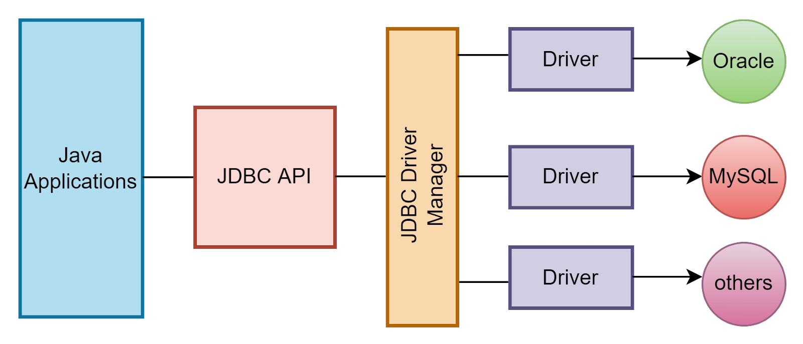

# Conexão com banco de dados - JDBC

> Projeto Java que demonstra como estabelecer conexão com um banco de dados relacional utilizando JDBC e Spring JDBC.

## 🚀 Rodando o projeto

### Pré-requisitos

1. Clone o repositório
2. Abra o projeto no IntelliJ IDEA
3. Execute a classe `Main` para rodar o projeto

### Sumário

- [O que é JDBC?](#o-que-é-jdbc)
  - [Spring JDBC](#spring-jdbc)
- [Configuração do projeto](#configuração-do-projeto)
  - [Dependências](#dependências)
  - [Driver JDBC](#driver-jdbc)
- [Banco de dados H2](#banco-de-dados-h2)
- [Utilização do JDBC](#utilização-do-jdbc)
  - [Estabalecendo conexão com o banco de dados](#estabalecendo-conexão-com-o-banco-de-dados)
  - [JdbcTemplate](#jdbctemplate)
  - [Métodos do JdbcTemplate](#métodos-do-jdbctemplate)
    - [Execute](#execute)
    - [Query](#query)
    - [Update](#update)
- [Referências](#referências)

## 📚 O que é JDBC?

JDBC (Java Database Connectivity) é uma API que permite a execução de operações em bancos de dados a partir de aplicações Java. Através do JDBC, é possível realizar operações como consultas, inserções, atualizações e exclusões de registros em bancos de dados relacionais.

### 🍃 Spring JDBC

O Spring JDBC é um módulo do Spring Framework que facilita o uso do JDBC em aplicações Java. O Spring JDBC simplifica a configuração do acesso a bancos de dados, permitindo a execução de operações de forma mais simples e segura.

## 🎚️ Configuração do projeto

### Dependências

Para utilizar o Spring JDBC em um projeto Java, é necessário adicionar as seguintes dependências ao arquivo `pom.xml`:

```xml
<dependency>
    <groupId>org.springframework</groupId>
    <artifactId>spring-jdbc</artifactId>
    <version>6.1.11</version>
</dependency>
<dependency>
    <groupId>org.apache.commons</groupId>
    <artifactId>commons-dbcp2</artifactId>
    <version>2.12.0</version>
</dependency>
```

### Driver JDBC

Além das dependências do Spring JDBC, é necessário adicionar o driver JDBC correspondente ao banco de dados que será utilizado. Os drivers JDBC são responsáveis por estabelecer a conexão entre a aplicação Java e o banco de dados.

Cada banco de dados possui um driver JDBC específico, que deve ser adicionado ao projeto como dependência.



```xml
<!-- Driver do servidor de banco H2 -->
<dependency>
    <groupId>com.h2database</groupId>
    <artifactId>h2</artifactId>
    <version>2.3.232</version>
</dependency>

<!-- Driver do servidor de banco MySQL -->
<dependency>
    <groupId>com.mysql</groupId>
    <artifactId>mysql-connector-j</artifactId>
    <version>9.0.0</version>
</dependency>

<!-- Driver do servidor de banco SQLServer -->
<dependency>
    <groupId>com.microsoft.sqlserver</groupId>
    <artifactId>mssql-jdbc</artifactId>
    <version>12.8.1.jre11</version>
</dependency>
```

## 💾 Banco de dados H2

O H2 é um banco de dados relacional escrito em Java, que pode ser utilizado em aplicações Java para testes e desenvolvimento. O H2 é um banco de dados leve e fácil de configurar, que pode ser executado em modo embarcado ou em modo servidor.

Nesse projeto, utilizamos o H2 em modo embarcado, que permite a criação de um banco de dados temporário em memória, que é destruído ao final da execução da aplicação.

### 🚧 Atenção

O H2 é um banco de dados temporário, que é destruído ao final da execução da aplicação. Portanto, ele não é recomendado para ambientes de produção, apenas para testes e desenvolvimento.

## 🧭 Utilização do JDBC

### Estabalecendo conexão com o banco de dados

Para estabelecer uma conexão com o banco de dados, é necessário configurar o `DataSource` do Spring JDBC. O `DataSource` é uma interface que define métodos para obter conexões com o banco de dados.

```java
BasicDataSource basicDataSource = new BasicDataSource();
basicDataSource.setUrl("jdbc:h2:mem:filmes");
basicDataSource.setUsername("sa");
basicDataSource.setPassword("");
```

### JdbcTemplate

O `JdbcTemplate` é uma classe do Spring JDBC que simplifica a execução de operações no banco de dados. O `JdbcTemplate` encapsula a lógica de abertura e fechamento de conexões, permitindo a execução de operações de forma mais simples e segura.

```java
JdbcTemplate jdbcTemplate = new JdbcTemplate(basicDataSource);
```

### Métodos do JdbcTemplate

#### Execute

O método `execute` é utilizado para executar operações no banco de dados que não retornam resultados, como a criação de tabelas e a inserção de registros.

```java
jdbcTemplate.execute("""
    CREATE TABLE filme (
        id INT AUTO_INCREMENT PRIMARY KEY,
        nome VARCHAR(255) NOT NULL,
        ano INT NOT NULL,
        genero VARCHAR(255) NOT NULL,
        diretor VARCHAR(255) NOT NULL
    )
    """);
```

#### Query

O método `query` é utilizado para executar consultas no banco de dados. O método `query` recebe como parâmetros a consulta SQL e um `RowMapper`, que é uma interface que mapeia os resultados da consulta para objetos Java.

```java
List<Filme> filmes = jdbcTemplate
        .query("SELECT * FROM filmes", new BeanPropertyRowMapper<Filme>());
```

Exemplo com parâmetros:

```java
List<Filme> filmes = jdbcTemplate.query(
        "SELECT * FROM filmes WHERE genero = ?",
        new BeanPropertyRowMapper<Filme>(), "Ação");
```

#### Update

O método `update` é utilizado para executar operações de inserção, atualização e exclusão no banco de dados. O método `update` recebe como parâmetros a operação SQL e os valores dos parâmetros da operação.

Exemplo de inserção:

```java
jdbcTemplate.update("INSERT INTO filme (nome, ano, genero, diretor) VALUES (?, ?, ?, ?)",
        "Matrix", 1999, "Ficção Científica", "Lana Wachowski, Lilly Wachowski");
```

Exemplo de atualização:

```java
jdbcTemplate.update(
        "UPDATE filme SET nome = ?, ano = ?, genero = ?, diretor = ? WHERE id = ?",
        "Shrek", 2001, "Animação", "Andrew Adamson", 4);
```

Exemplo de exclusão:

```java
jdbcTemplate.update("DELETE FROM filmes WHERE id = ?", 4);
```

### 📜 Referências

* [Data access with JDBC](https://docs.spring.io/spring-framework/docs/3.0.x/spring-framework-reference/html/jdbc.html)
* [Spring JDBC - Baeldung](https://www.baeldung.com/spring-jdbc-jdbctemplate)